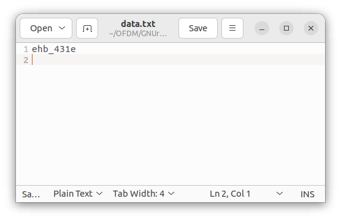
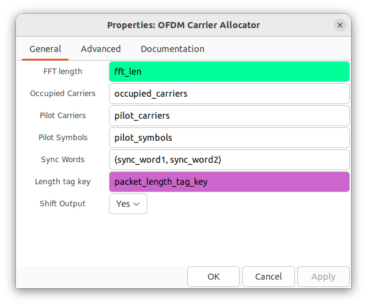
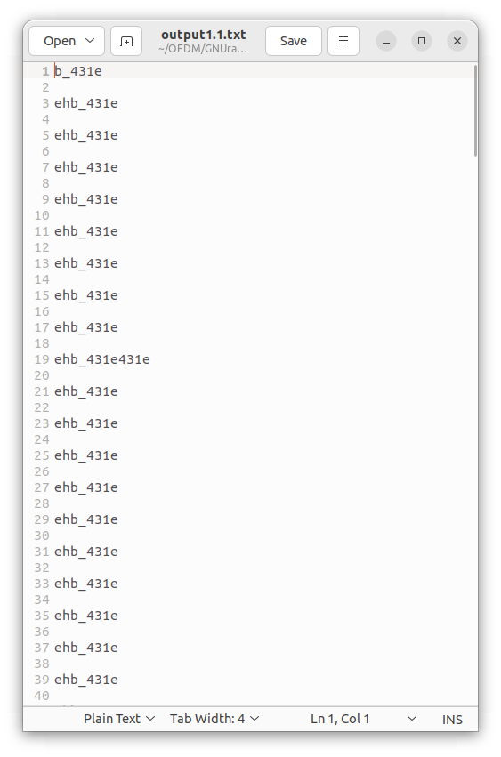

*Design and Application of Basic Communication
Systems - EHB 481E Project - Istanbul Technical University*

# OFDM with GNU Radio
Nurullah Aksu

M. Eymen Ünay

## Purpose of Project

In this project Orthogonal Frequency Division Multiplexing (OFDM) system
on GNU Radio is implemented and the path towards MIMO-OFDM system is
investigated. The purpose is to better understand transmitter and
receiver structure of OFDM and to discuss designing MIMO systems.

## Theoretical Background Information

### OFDM

OFDM is a digital modulation technique widely used in next generation
communication systems. OFDM allows simultaneous transmission of data
symbols on each subcarrier by dividing the available frequency spectrum
into multiple orthogonal subcarriers [@gold_smith; @wireless_book]. OFDM
provides several advantages such as high spectral efficiency, robustness
against frequency-selective fading and resistance to multipath
interference.

OFDM transmits high-rate signals by splitting the serial high-rate
signal into parallel low-bit streams. Following the conversion of the
serial data symbols to parallel data symbols, the time-domain OFDM
symbol is produced by the inverse fast Fourier transform (IFFT) block as
[@arslan2021wireless],

$$x_m(t)= \dfrac{1}{\sqrt{N}}\sum\limits_{k=0}^{N-1} X_m(k) e^{j2\pi k\triangle ft} \hspace{1cm} {0\le t\le T_s}.$$

Where N is the number of subcarriers, $X_m(k)$ is the transmitted data
symbol at the $k^{th}$ subcarrier of the $m^{th}$ OFDM symbol,
$\triangle f$ is the subcarrier spacing and $T_s$ is the duration of the
OFDM symbol. With a sampling rate of $T_s/N$, the discrete form of the
time-domain OFDM symbol can be expressed as,
$$x_m(n)= \dfrac{1}{\sqrt{N}}\sum\limits_{k=0}^{N-1} X_m(k) e^{j2\pi k\triangle f(T_s/N)} \hspace{0.5cm} {0\le n\le N-1}.$$

By assuring $T_s$ = $\dfrac{1}{\triangle f}$ , the subcarriers'
orthogonality is attained. As a result, the following is how the OFDM
symbol in time domain is written as,
$$x_m(n)= \dfrac{1}{\sqrt{N}}\sum\limits_{k=0}^{N-1} X_m(k) e^{j2\pi kn/N} \hspace{0.5cm} {0\le n\le N-1}.$$

Then, the signal is transmitted over the channel after parallel to
series conversion and adding cyclic prefix to avoid interference. The
received signal is converted frequency domain signal by utilizing
forward FFT after the channel estimation process. Finally, demodulation
steps are performed and the actual message is obtained. The general
block diagram is shown in Figure
[1](#fig:block_diagram){reference-type="ref"
reference="fig:block_diagram"}

![General block diagram of OFDM
[@block_diagram]](./Figures/Figures/ofdm_block_diagram.jpg){#fig:block_diagram
width="70%"}

### MIMO

As one of the diversity techniques MIMO, is a wireless communication
technology that improves the performance of wireless communication
systems by transmitting the signal over multiple transmitter antenna and
receiving it from multiple receiver antennas
[@wireless_book; @general_mimo]. One of the main purposes of the MIMO
systems is to increase the channel capacity and this is succeeded by
establishing multiple channels by using multiple antennas
[@general_mimo]. The key idea behind MIMO is to create multiple parallel
communication channels, each operating on the same frequency yet with
different antenna configurations.

Spatial multiplexing where multiple data streams are transmitted
simultaneously using different antennas, is enabled with MIMO. Thereby,
increased data throughput can be obtained, as the system can transmit
and receive multiple independent data streams concurrently. MIMO also
helps to combat fading and interference, as the signals from multiple
antennas can be combined or separated to mitigate the effects of
multipath propagation. Hence, lower error rates can be achieved with
MIMO systems in wireless communications [@wireless_book].

In conclusion, higher data rates, increased system capacity, improved
reliability and enhanced coverage can be accomplished with MIMO systems.

#### Maximum Ratio Combining {#sec:mrc}

When there are multiple antennas at the receiver side, the received
signals should be combined to reach the actual message. One of the
combining techniques is Maximum Ratio Combining (MRC). In this method,
the received signals coming from multiple antennas are combined to
improve the overall signal quality and mitigate the effects of fading
and interference [@gold_smith; @alamouti]. Another advantage of the MRC
is that different antennas may experience independent fading and
interference conditions. By combining these independent signals, MRC
provides diversity gain, which improves the system's reliability and
performance.

In MRC, the received signals from the N receiver antennas are weighted
and combined. This technique can be expressed theoretically. The
received signal from the N receiver antenna can be expressed as,

$$y_{N}=h_{N} s+n_{N}.$$

where $h_{N}$ is the channels of the N receiver antenna, $s$ is the
message signal and the $n_{N}$ is the AWGN noise. These received signals
are combined with MRC method. In detail, these signals are weighted
according to their channel characteristics and then they are combined.
This procedure can be expressed as,

$$\tilde{s}=\frac{h_0^* y_0+h_1^* y_1+\ldots+h_{N-1}^* y_{N-1}}{\left|h_0\right|^2+\left|h_1\right|^2+\ldots+\left|h_{N-1}\right|^2}$$

where $\tilde{s}$ is the combined signal. After that, detection and
demodulation processes are performed.

## Practical Background Information

### SDR

Software Defined Radio (SDR) is used to prototype wireless communication
systems and observe real life performance of these systems. SDR acts
like a bridge with its RF interface between wireless signals and the
host computer. The host computer can process the incoming RF signals by
performing various signal processing operations. The communication
system gets implemented in software with SDR's instead of hardware.

In this project Ettus USRP B200 mini SDR was used. It has a wide
frequency range of 70MHz - 6GHz, a programmable FPGA, high-speed USB 3
and open source driver support [@Brand2023May]. The internal block
diagram of the SDR used is presented in Figure
[2](#fig:ettus){reference-type="ref" reference="fig:ettus"}.

{#fig:ettus width="90%"}

### GNU Radio

GNU Radio is a free and open source software designed to provide signal
processing blocks which can be combined and used by the user with an SDR
or in a simulation. The signal processing blocks are engineered to run
as fast as possible but their interfaces can be as simple as a
flowgraph. GNU Radio can be used as a real time system, meaning all the
processing can be complete under the sampling period of the system
allowing it to be used in a large number of fields.

The source code of GNU Radio is publicly available. Performance
critical, commonly used blocks are mainly written in C++ and the rest is
in Python. GNU Radio can be used as a library in a Python script or its
companion application can be used. The GNU Radio Companion provides an
interface similar to Simulink. Under the hood, the application creates a
Python script corresponding to the input flowgraph. It is possible to
further modify the Python script or directly embed custom Python blocks
into the flowgraph.

## Project Steps

### OFDM Transmitter

In this section, OFDM transmitter structure in GNU Radio will be
described.

{#fig:crcqpsk
width="100%"}

The generation and modulation of the data can be seen in Figure
[3](#fig:crcqpsk){reference-type="ref" reference="fig:crcqpsk"}. Message
data is generated repeatedly in *Random Source* block. The size of the
data is adjustable. This data is packaged and tagged after *Stream to
Tagged Stream* block. Packet length is determined by tagging process.
Then error detection codes are added by *Stream CRC32* block. Finally,
the payload bits and header bits which are used in channel estimation
process are generated.

The header bits and the payload bits are modulated separately in the
*Chunks to Symbol* block. After this step, data is ready for the OFDM
processes.

File sources can be used instead of random data sources to analyze
errors more easily. Any binary can be sent however text file is used due
to its simplicity. The configuration for a *File Source* block can be
seen in Figure
[\[fig:filesource\]](#fig:filesource){reference-type="ref"
reference="fig:filesource"}. The full path of the file should be given
and the output type should be selected according to the system using the
data. The text used in this project is shown in Figure
[4](#fig:filesource_data){reference-type="ref"
reference="fig:filesource_data"}.

<figure id="fig:filesource_data">

<figcaption>Data to be transmitted.</figcaption>
</figure>

The *Tagged Stream Mux* block combines the QPSK modulated data and BPSK
modulated header into one stream. With the help of *QT GUI Constellation
Sink* block, the constellation is shown in Figure
[5](#fig:constell_tx){reference-type="ref" reference="fig:constell_tx"}.

{#fig:constell_tx
width="70%"}

{#fig:ofdm_tx width="90%"}

In Figure [6](#fig:ofdm_tx){reference-type="ref"
reference="fig:ofdm_tx"}, the OFDM transmitter system is shown. *Virtual
Source* with the *Pre-OFDM* id contains the combined header and data
payload. The whole signal passes through 3 main blocks before
transmission. Firstly, *OFDM Carrier Allocator* performs Series to
Parallel transformation together with pilot carrier insertion. The input
stream is split into vectors suitable for the FFT length and will be
processed in parallel. Figure
[\[fig:ofdm_carr_alloc\]](#fig:ofdm_carr_alloc){reference-type="ref"
reference="fig:ofdm_carr_alloc"} shows the parameters of this block.
Variables are used in complex GNU Radio applications to have common
parameters among blocks. In this case *occupied_carriers,
pilot_carriers, pilot_symbols* etc. are variables defined in the
flowgraph in a separate block. It is possible to configure these and
have different number of carriers or pilot signals.

In the second block, *FFT*, IFFT is performed as it can be seen from the
*Forward/Reverse* switch. Finally in the third block, *OFDM Cyclic
Prefixer*, adds cyclic prefix to the carriers. The resulting signal is
feed into *UHD: USRP Sink* block to send the signal from host computer
to the connected SDR and to transmit it.

It is important to configure the USRP to have successful communication,
the parameters of the project's USRP is shown in Figure
[7](#fig:usrp_settings){reference-type="ref"
reference="fig:usrp_settings"}. Gain should be selected carefully as too
much gain can cause harmonics and too low can cause the signal to have
lower reception. In addition, center frequency and the channel bandwidth
should be selected by considering transmitter antenna.

<figure id="fig:usrp_settings">

<figcaption>USRP settings used.</figcaption>
</figure>

The constellation of the transmitted signal is shown in Figure
[8](#fig:constell){reference-type="ref" reference="fig:constell"}.
Because the signal is in time domain the constellation does not have
distinction in distribution. The frequency spectrum of the transmitted
signal is shown in Figure [9](#fig:tx_freq){reference-type="ref"
reference="fig:tx_freq"}. The transmitted band can be clearly
differentiated from the ends of the spectrum.

{#fig:constell
width="70%"}

{#fig:tx_freq
width="100%"}

### OFDM Receiver

In this section, OFDM receiver structure in GNU Radio will be described.

The received signal from receiver USRP is forwarded to GNURadio
interface with the help of *UHD: USRP Source* block, it is shown in
Figure [10](#fig:schmid){reference-type="ref" reference="fig:schmid"}.
The center frequency and the channel bandwidth should be selected same
as the transmitted side to have better performance. Gain value should be
adjusted carrefully to avoid the noise enhencement. The adjustable
channel model block can be placed to see the effect of the channel on
the received signal. After the *Channel Model* block, starting time
instant of the frame is determined according to the Schmidl & Cox's
method in the *Schmidl & Cox OFDM synch.* block. Also, fine frequency
offset is calculated in the same block. The calculated frequency offset
is removed after *Frequency Mod* block.

{#fig:schmid
width="90%"}

The constellation diagram of the received signal can be seen in Figure
[11](#fig:constell_rx_presynch){reference-type="ref"
reference="fig:constell_rx_presynch"}. Since this diagram is obtained
after the channel, frequency offset effect can be seen easily. If the
pattern of the constellation diagram is like a square, it can be said
that, there is no frequency offset. However, because of the pattern of
the diagram is like a disk, existence of the frequency offset can be
noticed.

{#fig:constell_rx_presynch
width="70%"}

The frequency spectrum of the received signal is shown in the Figure
[12](#fig:freq_rx){reference-type="ref" reference="fig:freq_rx"}. Since
the channel bandwidth is adjusted to 15 MHz, the received signal band
can be seen 15 MHz around the center frequency.

{#fig:freq_rx
width="100%"}

{#fig:demux
width="120%"}

After the synchronization steps, the header bits and the payload bits
are splitted by using the *Header/Payload Demux* block. This block works
as a feedback system. It uses the synchronized data and splits the
header and payload data by using demodulated header data.

Now, the header stream is in time domain. Forward FFT is applied to
analyze and demodulate the OFDM signal. Also, this stream is converted
to the parallel streams in the *FFT* block. Next, the channel is
estimated by using synchronization words which are the same as with
trasnmitted side. The *ofdm_sync_carr_taps* information is obtained with
the help of this block. Then, at the *OFDM Frame Equalizer* block, the
phase and time offsets are eliminated and the channel effect is removed
by the equalization formula below [@ofdm_website],

$$\alpha * H[k] + (1-\alpha) * \frac{s_{i, k}}{p_j}$$

where $H$ is the channel response in the frequency domain, $s_{i, k}$ is
the received signal, $p_j$ is the inserted pilot symbol and $\alpha$ is
the constant which is equal to $0.1$.

{#fig:ch_est_ofdm
width="70%"}

{#fig:ofdm_rx
width="70%"}

The received data is processed by demodulating and removing CRC as shown
in Figure [16](#fig:qpsk_rx){reference-type="ref"
reference="fig:qpsk_rx"}. Constellation of the demodulated data is shown
in Figure [17](#fig:constell_rx){reference-type="ref"
reference="fig:constell_rx"}. When compared to Figure
[5](#fig:constell_tx){reference-type="ref" reference="fig:constell_tx"},
BPSK constellation is not visible because here the constellation is
observed after demuxing the header and payload data streams.

{#fig:qpsk_rx
width="80%"}

{#fig:constell_rx
width="70%"}

The received data is appended to a file when the system is running.
*File Sink* settings is shown in Figure
[\[fig:file_sink_sett\]](#fig:file_sink_sett){reference-type="ref"
reference="fig:file_sink_sett"} which is similar to *File Source*. Path
and input type can be configured. Select buffered option to buffer the
incoming data in memory before writing to file if I/O is causing a
problem. The received data can be seen in Figure
[18](#fig:data_out){reference-type="ref" reference="fig:data_out"}.
Notice contrary to most, some data is lost. Error can be calculated by
comparing the input file and the data received.

<figure id="fig:data_out">

<figcaption>Text output of received data.</figcaption>
</figure>

### MRC Blocks

After implementing OFDM transceiver, a MISO system is investigated as
the first step towards a MIMO system. A system with a single transmitter
and multiple receivers was designed in GNU Radio Companion and with
physical SDR devices. Maximum Ratio Combining (MRC), which was also
discussed in Section [2.2.1](#sec:mrc){reference-type="ref"
reference="sec:mrc"}, was implemented. MRC requires channel tap
information in the algorithm which *OFDM Channel Estimation* block
provides. A *Tag Gate* block is used to isolate the channel tap tag
information from the rest of tags as shown in Figure
[19](#fig:channel_system){reference-type="ref"
reference="fig:channel_system"}.

{#fig:channel_system
width="70%"}

The custom MRC block was designed as a *Hier Block* as shown in Figure
[20](#fig:mrc){reference-type="ref" reference="fig:mrc"} which is a
flowgraph that can be imported to other flowgraphs in a single block.
The algorithm is implemented using built-in computation blocks. Due to
crashes we had while working real-time, offline analysis is performed in
the Figure. Received data and channel taps are feed to the system which
were collected from a real time operation.

{#fig:mrc
width="110%"}
