
<strong>Design and Applications of Basic Communication
Systems</strong>

<strong>EHB 481E</strong>

MIMO OFDM with GNU Radio

Nurullah Aksu

M. Eymen Ünay

<h1 id="purpose-of-project">Purpose of Project</h1>

In this project Orthogonal Frequency Division Multiplexing (OFDM)
system on GNU Radio is implemented and the path towards MIMO-OFDM system
is investigated. The purpose is to better understand transmitter and
receiver structure of OFDM and to discuss designing MIMO systems.

<h1 id="theoretical-background-information">Theoretical Background
Information</h1>
<h2 id="ofdm">OFDM</h2>

OFDM is a digital modulation technique widely used in next generation
communication systems. OFDM allows simultaneous transmission of data
symbols on each subcarrier by dividing the available frequency spectrum
into multiple orthogonal subcarriers . OFDM provides several
advantages such as high spectral efficiency, robustness against
frequency-selective fading and resistance to multipath interference.

OFDM transmits high-rate signals by splitting the serial high-rate
signal into parallel low-bit streams. Following the conversion of the
serial data symbols to parallel data symbols, the time-domain OFDM
symbol is produced by the inverse fast Fourier transform (IFFT) block as
,

$$x_m(t)=
\dfrac{1}{\sqrt{N}}\sum\limits_{k=0}^{N-1} X_m(k) e^{j2\pi k\triangle
ft} \hspace{1cm} {0\le t\le T_s}.$$

Where N is the number of subcarriers, <em>X</em><em>m</em>(<em>k</em>)
is the transmitted data symbol at the <em>k</em><em>t</em><em>h</em>
subcarrier of the <em>m</em><em>t</em><em>h</em>
OFDM symbol, △<em>f</em> is the
subcarrier spacing and <em>T</em><em>s</em> is the
duration of the OFDM symbol. With a sampling rate of <em>T</em><em>s</em>/<em>N</em>,
the discrete form of the time-domain OFDM symbol can be expressed as,
$$x_m(n)=
\dfrac{1}{\sqrt{N}}\sum\limits_{k=0}^{N-1} X_m(k) e^{j2\pi k\triangle
f(T_s/N)} \hspace{0.5cm} {0\le n\le N-1}.$$

By assuring <em>T</em><em>s</em> = $\dfrac{1}{\triangle f}$ , the subcarriers’
orthogonality is attained. As a result, the following is how the OFDM
symbol in time domain is written as, $$x_m(n)=
\dfrac{1}{\sqrt{N}}\sum\limits_{k=0}^{N-1} X_m(k) e^{j2\pi kn/N}
\hspace{0.5cm} {0\le n\le N-1}.$$

Then, the signal is transmitted over the channel after parallel to
series conversion and adding cyclic prefix to avoid interference. The
received signal is converted frequency domain signal by utilizing
forward FFT after the channel estimation process. Finally, demodulation
steps are performed and the actual message is obtained. The general
block diagram is shown in Figure <a href="#fig:block_diagram"
data-reference-type="ref" data-reference="fig:block_diagram">1</a>

<figure id="fig:block_diagram">
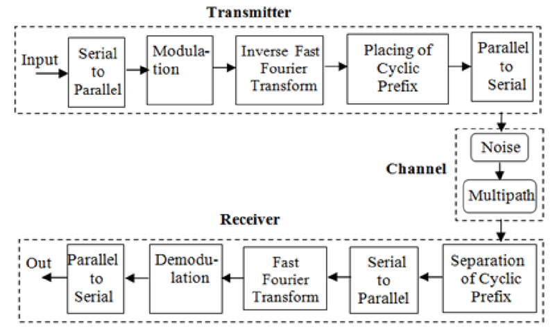
<figcaption>General block diagram of OFDM </figcaption>
</figure>
<h2 id="mimo">MIMO</h2>

As one of the diversity techniques MIMO, is a wireless communication
technology that improves the performance of wireless communication
systems by transmitting the signal over multiple transmitter antenna and
receiving it from multiple receiver antennas . One of the main
purposes of the MIMO systems is to increase the channel capacity and
this is succeeded by establishing multiple channels by using multiple
antennas . The
key idea behind MIMO is to create multiple parallel communication
channels, each operating on the same frequency yet with different
antenna configurations.

Spatial multiplexing where multiple data streams are transmitted
simultaneously using different antennas, is enabled with MIMO. Thereby,
increased data throughput can be obtained, as the system can transmit
and receive multiple independent data streams concurrently. MIMO also
helps to combat fading and interference, as the signals from multiple
antennas can be combined or separated to mitigate the effects of
multipath propagation. Hence, lower error rates can be achieved with
MIMO systems in wireless communications .

In conclusion, higher data rates, increased system capacity, improved
reliability and enhanced coverage can be accomplished with MIMO
systems.

<h3 id="sec:mrc">Maximum Ratio Combining</h3>

When there are multiple antennas at the receiver side, the received
signals should be combined to reach the actual message. One of the
combining techniques is Maximum Ratio Combining (MRC). In this method,
the received signals coming from multiple antennas are combined to
improve the overall signal quality and mitigate the effects of fading
and interference . Another advantage of the MRC
is that different antennas may experience independent fading and
interference conditions. By combining these independent signals, MRC
provides diversity gain, which improves the system’s reliability and
performance.

In MRC, the received signals from the N receiver antennas are
weighted and combined. This technique can be expressed theoretically.
The received signal from the N receiver antenna can be expressed as,

<em>y</em><em>N</em> = <em>h</em><em>N</em><em>s</em> + <em>n</em><em>N</em>.

where <em>h</em><em>N</em> is the
channels of the N receiver antenna, <em>s</em> is the message signal and the
<em>n</em><em>N</em> is the
AWGN noise. These received signals are combined with MRC method. In
detail, these signals are weighted according to their channel
characteristics and then they are combined. This procedure can be
expressed as,

$$\Tilde{s}=\frac{h_0^* y_0+h_1^*
y_1+\ldots+h_{N-1}^*
y_{N-1}}{\left|h_0\right|^2+\left|h_1\right|^2+\ldots+\left|h_{N-1}\right|^2}$$

where $\Tilde{s}$ is the combined
signal. After that, detection and demodulation processes are
performed.

<h1 id="practical-background-information">Practical Background
Information</h1>
<h2 id="sdr">SDR</h2>

Software Defined Radio (SDR) is used to prototype wireless
communication systems and observe real life performance of these
systems. SDR acts like a bridge with its RF interface between wireless
signals and the host computer. The host computer can process the
incoming RF signals by performing various signal processing operations.
The communication system gets implemented in software with SDR’s instead
of hardware.

In this project Ettus USRP B200 mini SDR was used. It has a wide
frequency range of 70MHz - 6GHz, a programmable FPGA, high-speed USB 3
and open source driver support . The internal block diagram of the SDR
used is presented in Figure <a href="#fig:ettus"
data-reference-type="ref" data-reference="fig:ettus">2</a>.

<figure id="fig:ettus">
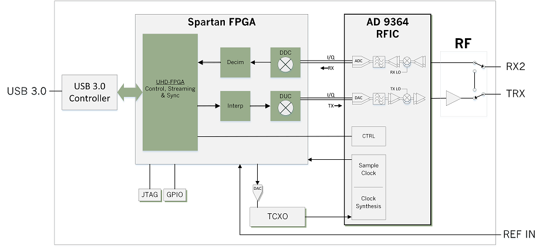
<figcaption>Block diagram of Ettus USRP B200 mini</figcaption>
</figure>
<h2 id="gnu-radio">GNU Radio</h2>

GNU Radio is a free and open source software designed to provide
signal processing blocks which can be combined and used by the user with
an SDR or in a simulation. The signal processing blocks are engineered
to run as fast as possible but their interfaces can be as simple as a
flowgraph. GNU Radio can be used as a real time system, meaning all the
processing can be complete under the sampling period of the system
allowing it to be used in a large number of fields.

The source code of GNU Radio is publicly available. Performance
critical, commonly used blocks are mainly written in C++ and the rest is
in Python. GNU Radio can be used as a library in a Python script or its
companion application can be used. The GNU Radio Companion provides an
interface similar to Simulink. Under the hood, the application creates a
Python script corresponding to the input flowgraph. It is possible to
further modify the Python script or directly embed custom Python blocks
into the flowgraph.

<h1 id="project-steps">Project Steps</h1>
<h2 id="ofdm-transmitter">OFDM Transmitter</h2>

In this section, OFDM transmitter structure in GNU Radio will be
described.

<figure id="fig:crcqpsk">
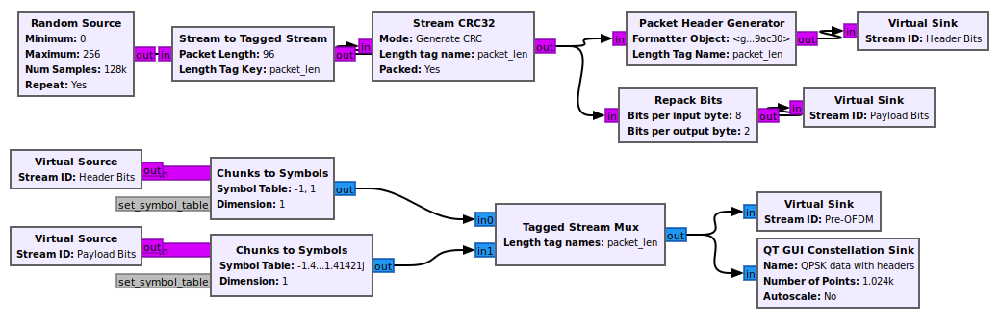
<figcaption>CRC and modulation system in OFDM transmitter.</figcaption>
</figure>

The generation and modulation of the data can be seen in Figure <a
href="#fig:crcqpsk" data-reference-type="ref"
data-reference="fig:crcqpsk">3</a>. Message data is generated repeatedly
in <em>Random Source</em> block. The size of the data is adjustable.
This data is packaged and tagged after <em>Stream to Tagged Stream</em>
block. Packet length is determined by tagging process. Then error
detection codes are added by <em>Stream CRC32</em> block. Finally, the
payload bits and header bits which are used in channel estimation
process are generated.

The header bits and the payload bits are modulated separately in the
<em>Chunks to Symbol</em> block. After this step, data is ready for the
OFDM processes.

File sources can be used instead of random data sources to analyze
errors more easily. Any binary can be sent however text file is used due
to its simplicity. The configuration for a <em>File Source</em> block
can be seen in Figure <a href="#fig:filesource"
data-reference-type="ref"
data-reference="fig:filesource">[fig:filesource]</a>. The full path of
the file should be given and the output type should be selected
according to the system using the data. The text used in this project is
shown in Figure <a href="#fig:filesource_data" data-reference-type="ref"
data-reference="fig:filesource_data">4</a>.

<figure id="fig:filesource_data">

<figcaption>Data to be transmitted.</figcaption>
</figure>

The <em>Tagged Stream Mux</em> block combines the QPSK modulated data
and BPSK modulated header into one stream. With the help of <em>QT GUI
Constellation Sink</em> block, the constellation is shown in Figure <a
href="#fig:constell_tx" data-reference-type="ref"
data-reference="fig:constell_tx">5</a>.

<figure id="fig:constell_tx">

<figcaption>Constellation of the modulated data.</figcaption>
</figure>
<figure id="fig:ofdm_tx">
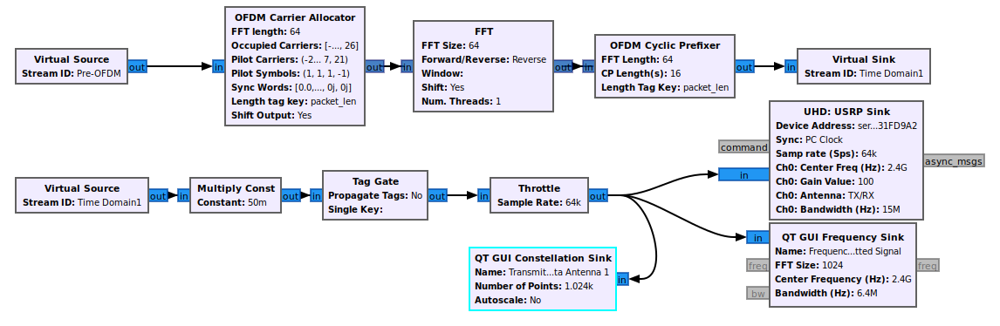
<figcaption>OFDM transmitter system.</figcaption>
</figure>

In Figure <a href="#fig:ofdm_tx" data-reference-type="ref"
data-reference="fig:ofdm_tx">6</a>, the OFDM transmitter system is
shown. <em>Virtual Source</em> with the <em>Pre-OFDM</em> id contains
the combined header and data payload. The whole signal passes through 3
main blocks before transmission. Firstly, <em>OFDM Carrier
Allocator</em> performs Series to Parallel transformation together with
pilot carrier insertion. The input stream is split into vectors suitable
for the FFT length and will be processed in parallel. Figure <a
href="#fig:ofdm_carr_alloc" data-reference-type="ref"
data-reference="fig:ofdm_carr_alloc">[fig:ofdm_carr_alloc]</a> shows the
parameters of this block. Variables are used in complex GNU Radio
applications to have common parameters among blocks. In this case
<em>occupied_carriers, pilot_carriers, pilot_symbols</em> etc. are
variables defined in the flowgraph in a separate block. It is possible
to configure these and have different number of carriers or pilot
signals.

In the second block, <em>FFT</em>, IFFT is performed as it can be
seen from the <em>Forward/Reverse</em> switch. Finally in the third
block, <em>OFDM Cyclic Prefixer</em>, adds cyclic prefix to the
carriers. The resulting signal is feed into <em>UHD: USRP Sink</em>
block to send the signal from host computer to the connected SDR and to
transmit it.

It is important to configure the USRP to have successful
communication, the parameters of the project’s USRP is shown in Figure
<a href="#fig:usrp_settings" data-reference-type="ref"
data-reference="fig:usrp_settings">7</a>. Gain should be selected
carefully as too much gain can cause harmonics and too low can cause the
signal to have lower reception. In addition, center frequency and the
channel bandwidth should be selected by considering transmitter
antenna.

<figure id="fig:usrp_settings">

<figcaption>USRP settings used.</figcaption>
</figure>

The constellation of the transmitted signal is shown in Figure <a
href="#fig:constell" data-reference-type="ref"
data-reference="fig:constell">8</a>. Because the signal is in time
domain the constellation does not have distinction in distribution. The
frequency spectrum of the transmitted signal is shown in Figure <a
href="#fig:tx_freq" data-reference-type="ref"
data-reference="fig:tx_freq">9</a>. The transmitted band can be clearly
differentiated from the ends of the spectrum.

<figure id="fig:constell">
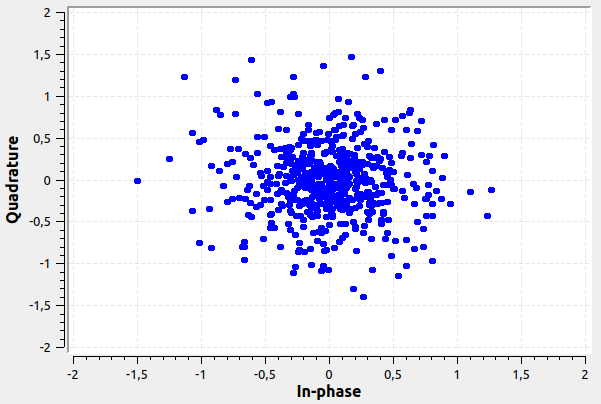
<figcaption>Constellation of transmitted signal.</figcaption>
</figure>
<figure id="fig:tx_freq">

<figcaption>Transmitted signal frequency spectrum.</figcaption>
</figure>
<h2 id="ofdm-receiver">OFDM Receiver</h2>

In this section, OFDM receiver structure in GNU Radio will be
described.

The received signal from receiver USRP is forwarded to GNURadio
interface with the help of <em>UHD: USRP Source</em> block, it is shown
in Figure <a href="#fig:schmid" data-reference-type="ref"
data-reference="fig:schmid">10</a>. The center frequency and the channel
bandwidth should be selected same as the transmitted side to have better
performance. Gain value should be adjusted carrefully to avoid the noise
enhencement. The adjustable channel model block can be placed to see the
effect of the channel on the received signal. After the <em>Channel
Model</em> block, starting time instant of the frame is determined
according to the Schmidl &amp; Cox’s method in the <em>Schmidl &amp; Cox
OFDM synch.</em> block. Also, fine frequency offset is calculated in the
same block. The calculated frequency offset is removed after
<em>Frequency Mod</em> block.

<figure id="fig:schmid">

<figcaption>Schmidl &amp; Cox Synchronization system in OFDM
receiver.</figcaption>
</figure>

The constellation diagram of the received signal can be seen in
Figure <a href="#fig:constell_rx_presynch" data-reference-type="ref"
data-reference="fig:constell_rx_presynch">11</a>. Since this diagram is
obtained after the channel, frequency offset effect can be seen easily.
If the pattern of the constellation diagram is like a square, it can be
said that, there is no frequency offset. However, because of the pattern
of the diagram is like a disk, existence of the frequency offset can be
noticed.

<figure id="fig:constell_rx_presynch">
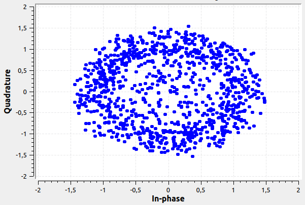
<figcaption>Constellation of received signal before
synchronization.</figcaption>
</figure>

The frequency spectrum of the received signal is shown in the Figure
<a href="#fig:freq_rx" data-reference-type="ref"
data-reference="fig:freq_rx">12</a>. Since the channel bandwidth is
adjusted to 15 MHz, the received signal band can be seen 15 MHz around
the center frequency.

<figure id="fig:freq_rx">

<figcaption>Frequency spectrum of received signal.</figcaption>
</figure>
<figure id="fig:demux">
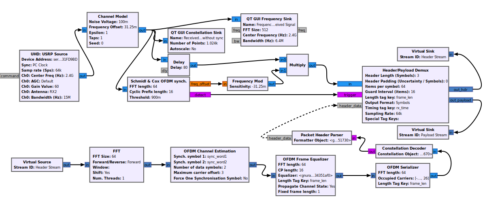
<figcaption>Header and Payload Demux in OFDM receiver.</figcaption>
</figure>

After the synchronization steps, the header bits and the payload bits
are splitted by using the <em>Header/Payload Demux</em> block. This
block works as a feedback system. It uses the synchronized data and
splits the header and payload data by using demodulated header data.

Now, the header stream is in time domain. Forward FFT is applied to
analyze and demodulate the OFDM signal. Also, this stream is converted
to the parallel streams in the <em>FFT</em> block. Next, the channel is
estimated by using synchronization words which are the same as with
trasnmitted side. The <em>ofdm_sync_carr_taps</em> information is
obtained with the help of this block. Then, at the <em>OFDM Frame
Equalizer</em> block, the phase and time offsets are eliminated and the
channel effect is removed by the equalization formula below ,

$$\alpha * H[k] + (1-\alpha) * \frac{s_{i,
k}}{p_j}$$

where <em>H</em> is the channel
response in the frequency domain, <em>s</em><em>i</em>, <em>k</em>
is the received signal, <em>p</em><em>j</em> is the
inserted pilot symbol and <em>α</em> is
the constant which is equal to 0.1.

<figure id="fig:ch_est_ofdm">
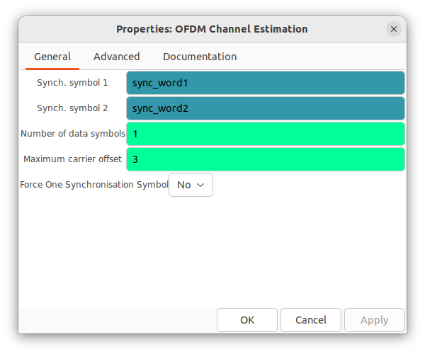
<figcaption>OFDM channel estimation parameters.</figcaption>
</figure>
<figure id="fig:ofdm_rx">

<figcaption>OFDM receiver system.</figcaption>
</figure>

The received data is processed by demodulating and removing CRC as
shown in Figure <a href="#fig:qpsk_rx" data-reference-type="ref"
data-reference="fig:qpsk_rx">16</a>. Constellation of the demodulated
data is shown in Figure <a href="#fig:constell_rx"
data-reference-type="ref" data-reference="fig:constell_rx">17</a>. When
compared to Figure <a href="#fig:constell_tx" data-reference-type="ref"
data-reference="fig:constell_tx">5</a>, BPSK constellation is not
visible because here the constellation is observed after demuxing the
header and payload data streams.

<figure id="fig:qpsk_rx">
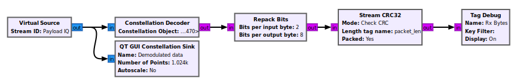
<figcaption>CRC removal and QPSK demodulation in receiver.</figcaption>
</figure>
<figure id="fig:constell_rx">
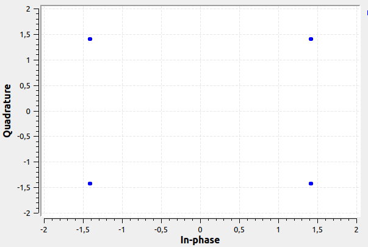
<figcaption>Constellation of demodulated data in OFDM
receiver.</figcaption>
</figure>

The received data is appended to a file when the system is running.
<em>File Sink</em> settings is shown in Figure <a
href="#fig:file_sink_sett" data-reference-type="ref"
data-reference="fig:file_sink_sett">[fig:file_sink_sett]</a> which is
similar to <em>File Source</em>. Path and input type can be configured.
Select buffered option to buffer the incoming data in memory before
writing to file if I/O is causing a problem. The received data can be
seen in Figure <a href="#fig:data_out" data-reference-type="ref"
data-reference="fig:data_out">18</a>. Notice contrary to most, some data
is lost. Error can be calculated by comparing the input file and the
data received.

<figure id="fig:data_out">

<figcaption>Text output of received data.</figcaption>
</figure>
<h2 id="mrc-blocks">MRC Blocks</h2>

After implementing OFDM transceiver, a MISO system is investigated as
the first step towards a MIMO system. A system with a single transmitter
and multiple receivers was designed in GNU Radio Companion and with
physical SDR devices. Maximum Ratio Combining (MRC), which was also
discussed in Section <a href="#sec:mrc" data-reference-type="ref"
data-reference="sec:mrc">2.2.1</a>, was implemented. MRC requires
channel tap information in the algorithm which <em>OFDM Channel
Estimation</em> block provides. A <em>Tag Gate</em> block is used to
isolate the channel tap tag information from the rest of tags as shown
in Figure <a href="#fig:channel_system" data-reference-type="ref"
data-reference="fig:channel_system">19</a>.

<figure id="fig:channel_system">
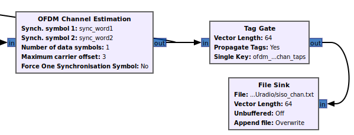
<figcaption>Channel system.</figcaption>
</figure>

The custom MRC block was designed as a <em>Hier Block</em> as shown
in Figure <a href="#fig:mrc" data-reference-type="ref"
data-reference="fig:mrc">20</a> which is a flowgraph that can be
imported to other flowgraphs in a single block. The algorithm is
implemented using built-in computation blocks. Due to crashes we had
while working real-time, offline analysis is performed in the Figure.
Received data and channel taps are feed to the system which were
collected from a real time operation.

<figure id="fig:mrc">

<figcaption>MRC hierarchy block.</figcaption>
</figure>
</body>
</html>
